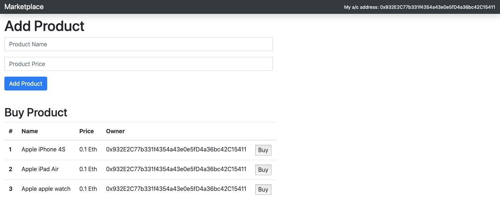

# react-dapp-marketplace

## Description

Marketplace dApp built with React.js, Truffle, and Ganach

**_DEMO:_**



## Feature

- Able to sell (add) products by Ethereum
- Able to purchase products by Ethreum
- Shows owner accounts of Metamask address

## Requirement

- npm
- Metamask
- Ganache

## Usage / Install

1. Run Ganache & Setup Metamask with Ganache

   Copy the RPC Server from Ganache. eg: [HTTP://127.0.0.1:7545] </br>
   Then choose the network as Custom RPC in Metamask, paste the above mentioned RPC Server into `New RPC URL` and save.</br>
   Choose this custom network in Metamask.

2. Run react application

   Clone repo, cd into folder and run:

```console
$ npm install
$ npm start
```

## Tools

- Web3
- Truffle
- Chai
- React.js
- Bootstrap
- Infula (To delpoy on the Kovan test network)

## Licence

[MIT](./LICENSE.txt)

## Author

[Shoe Kure](https://github.com/roy1210)
